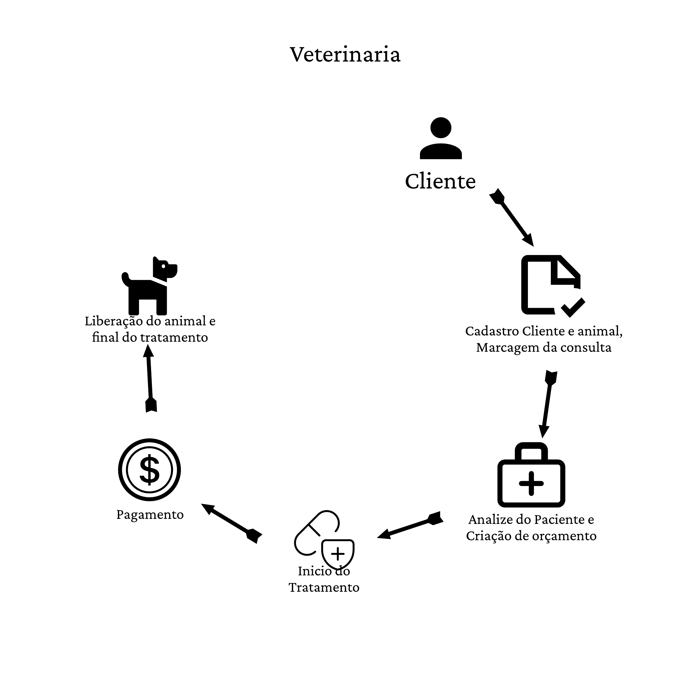

# Projeto Integrador - Clinica Veterinária

Um modelo para o desenvolvimento do Projeto Integrador do Curso de Técnico em Desenvolvimento de Sistemas para a Internet Integrado ao Ensino Médio do IFC - Campus Araquari.

Alunos: [MIguel Bochi](github.com/MiguelBochiBarros) e [Juan Padilha](https://github.com/alujuan).

Links do projeto:

-   [Documentação (esse documento)](github.com/MiguelBochiBarros/Panic_Donkey)
-   [Backend](github.com/MiguelBochiBarros/pi-backend)
-   [Frontend](github.com/MiguelBochiBarros/pi-frontend)

# Modelos de Sistemas

## 3- Ordem de Serviço (O.S.)

**Veterinária**

O Sr. Bob, nosso cliente, se formou em veterinária de animais de pequeno porte e exóticos e decidiu abrir um negócio, onde ele é responsável pelos cuidados dos animais e sua ajudante Nã realiza os atendimentos aos clientes. Com sua visão empreendedora, ele sentiu a necessidade de um software que auxilie sua ajudante nas tarefas diárias. Para isso, ele deseja um sistema que gerencie os clientes, orçamentos, tratamentos e saída dos animais. Sendo um negócio pequeno, é muito importante que ele consiga ter relatórios que lhe ajudem na gestão do consultório, como dos status dos serviços.

# Situação Problema

**Nessa parte a equipe deve descrever a situação problema que será resolvida pelo sistema. O texto abaixo descreve o que essa etapa deve conter e pode ser apagado depois.**

-   **Introdução** A empresa é uma pequena veterinária chamada Biologic animal farm que começou a ter um crescimento nos  últimos meses, seu dono é um veterinário chamado Sr. Bob faz os cuidados e o tratamento dos animais, junto a isso tem sua funcionária Nã que ajuda na recepção dos clientes e da manutenção geral.

-   **Situação-problema**: A empresa funciona em etapas: cliente, cadastro, análise do paciente e orçamento, análise de crédito, tratamento, paga marcado uma consulta;
    - Análise do paciente e orçamento: na consulta é avaliado a situação do animal e após isso é feito um orçamento(material e tempo);
    - Análise de crédito: caso o tratamento demande muito esforço e material é feito uma análise de orçamento;
    - Tratamento: o tratamento pode ser feito de diversas formas, desde cirurgias até medicações;
    - Pagamento inicial: inicialização do pagamento, podendo ser em prestações ou à vista. 
    - Liberação do animal: após o tratamento o animal é liberado para ir embora. 

-   **Conclusão**: Vemos que sem  um sistema fica difícil categorizar os animais que estão em tratamento ou já saíram dele, e também temos dificuldade em ver como está o pagamento do tratamento e confirmar se foi feita a análise de crédito.

# Descrição da proposta
Criar um programa que auxilia na r etenção de dados referente aos animais aos pagamentos e aos tratamentos, evitando a perdUntitleda de informações

**Alguns pontos importantes a se destacar são:**

-   **Qual o foco de ação do software** Ter um acesso mais rápido ao dados relacionados aos animais e seus pagamentos sem a perda de informações.
-    **Os níveis de usuário do sistema** O gestor terá acesso total aoUntitled e checagem de dados.
    -   **Se houver mais de um nível de usuário** A usuários de terem diferenças sendo os de maior nível tendo a capacidade de manipular os dados podendo deletá los, diferentes dos usuários de baixa nivel podem amenas cadastrar e pesquisar
    
# Regras de negócio

-   **RN01 - Cadastro:** Para fazer o atendimento é necessário o cadastro do cliente e do animal.
-   **RN02 - Análise do paciente:** Para que ocorra a análise, o paciente deve estar cadastrado e com o horário mar cado.
-   **RN03 - Análise do orçamento:** O orçamento só pode ser registrado após a análise do paciente.
-   **RN04 - Tratamento:** O tratamento só pode ser feito em um animal já cadastrado e com a análise.
-   **RNnegócio05 - Pagamento e liberação do animal :** O pagamento inicial só pode ser feito após o tratamento do animal e assim, é possível haver a liberação do animal.

# Requisitos Funcionais

-   **RF001 - Cadastro de clientes:** O sistema deve permitir o cadastro de novos clientes, com informações como nome, endereço, telefone e e-mail.

-   **RF002 - Cadastro de animais:** O sistema deve permitir o cadastro de animais dos clientes, com informações como nome, espécie, raça e idade.

-   **RF003 - Agendamento de consultas:** O sistema deve permitir o agendamento de consultas para os animais cadastrados, com informações como data e hora da consulta.

-   **RF004 - Análise do paciente:** O sistema deve permitir a análise do animal durante a consulta, registrando informações como sintomas, histórico médico e exames realizados.

-   **RF005 - Orçamento:** O sistema deve permitir a criação de orçamentos para o tratamento do animal, registrando informações como materiais necessários e tempo de tratamento.

-   **RF006 - Análise de crédito:** O sistema deve permitir a análise de crédito para o pagamento do tratamento, registrando informações como renda e histórico de crédito.

-   **RF007 - Tratamento:** O sistema deve permitir o registro do tratamento realizado no animal, com informações como medicamentos utilizados, procedimentos cirúrgicos e resultados dos exames.

-   **RF008 - Pagamento:** O sistema deve permitir o registro dos pagamentos realizados pelo cliente, com informações como forma de pagamento, data e valor.

-   **RF009 - Liberação do animal:** O sistema deve permitir a liberação do animal após o tratamento e pagamento, registrando a data e hora da liberação.

-   **RF010 - Relatórios:** O sistema deve permitir a geração de relatórios para a gestão do consultório, como o status dos serviços, clientes inadimplentes e animais em tratamento.

    